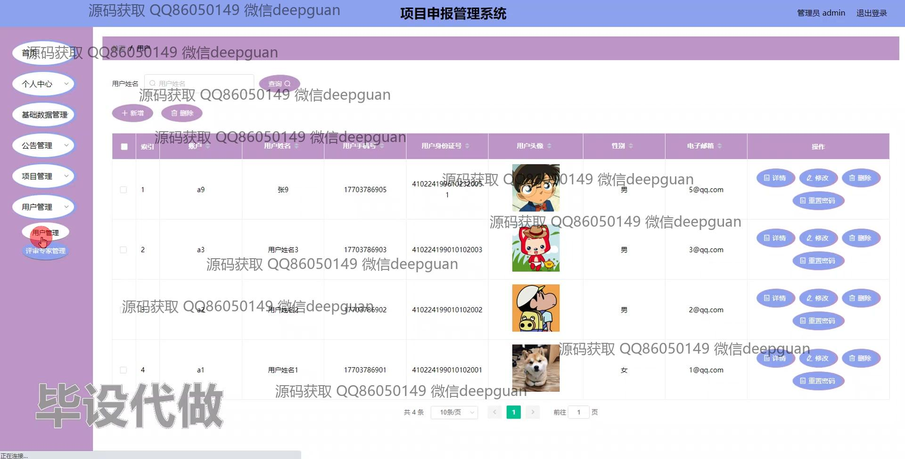

<h1 align="center">项目申报管理系统</h1>

## 简介
项目申报管理系统：角色分为管理员、评审专家、用户；功能包括项目申请、审核、管理、成果评估、用户管理，提供简洁高效的项目管理流程，适用于高校或科研机构的需求。    --计算机毕业设计源码；毕设源码；java毕业设计源码

## 联系方式

<h3 align="center">获取完整代码与数据库文件 + 微信：deepguan QQ: 86050149 QQ群: 783742310</h3>

<h3 align="center">可帮忙远程部署 包运行成功！提供远程部署、修改代码、设计文档指导、代码讲解等服务！</h3>

## 功能介绍（完整见运行截图）
管理员：管理员可以通过项目申报管理系统进行用户管理，包括查看用户列表信息，修改用户信息，重置密码和删除用户等操作。此外，管理员能够管理项目信息，执行项目的审核、修改和删除。系统提供的研究方向管理功能允许管理员对研究方向进行录入、查询和修改。管理员在系统登录后可以通过丰富的筛选条件进行项目搜索，查看项目进展，并通过系统提供的数据统计分析功能了解整体申报情况。

用户：用户在项目申报管理系统中可以完成账户注册和登录，进入个人中心后能查看和修改个人信息，如用户名、手机号、电子邮箱和身份证号。用户可以进行项目申报，包括录入项目信息，如项目编号、名称、课程来源、项目信型和项目花费等，并通过上传附件补充项目详情。系统支持用户选择审评专家和研究方向，以及在项目结果评估模块中填写评估信息。此外，用户界面提供了通过筛选条件进行项目查询的功能，以便及时了解项目状态和评估结果。

评审专家：评审专家在项目申报管理系统中可通过角色选择登录后进入评估管理模块。专家可以查看待评审项目的详细信息，包括项目名称、类型、申请状态等，并能通过表单输入评估结果和评分。系统为评审专家提供了便捷的项目筛选和查询功能，以确保准确及时地完成评审任务。评审操作界面简洁明了，支持专家对项目进行反馈和记录评估时间。

普通申请者：普通申请者可以在项目申报管理系统中完成注册后登录进行项目申请，填写项目信息表单如项目名称、编号、课程来源和预计花费等。申请者在提交申请后可以在个人中心跟踪项目审核状态、修改申请内容和重新提交。此外，系统允许普通申请者在研究方向模块进行方向选择和信息更新，以便在项目申报和管理过程中提供具体的研究领域细节。

## 运行截图

本代码来源于网络,仅供学习参考使用!

